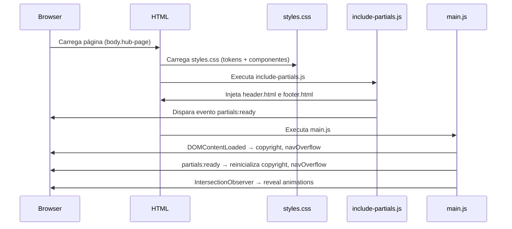

# Documento de Design — Redesign da Landing Page

## Visão Geral

Este documento descreve a arquitetura técnica para o redesign completo do site alexarnoni.com. O objetivo central é substituir o sistema visual atual — que usa múltiplos temas por página (medieval escuro, fintech, terminal, esportivo, sci-fi) com blocos `<style>` inline e overrides de header/footer — por um design system unificado baseado no tema índigo claro (`hub-page`).

O resultado final será:
- Um único `styles.css` com tokens globais e classes reutilizáveis
- Todas as páginas usando `<body class="hub-page">` sem `<style>` inline
- Header e footer com aparência idêntica em todas as páginas
- `main.js` limpo, sem código legado (parallax, flicker, scanner)
- Reveal animations via IntersectionObserver centralizado no main.js

### Decisões de Design

1. **Tema único vs. temas por página**: Optou-se por eliminar todos os temas específicos (`.astraea-page`, `.olheiro-page`, `.bot-page`, `.finance-page`, `.aenvar-page`) em favor de um único tema índigo claro. Isso reduz a complexidade do CSS de ~1170 linhas para ~600-700 linhas e elimina overrides de header/footer por página.

2. **Classes genéricas para projetos**: Em vez de classes prefixadas por projeto (`.olheiro-hero`, `.astraea-feature-card`), o design usa classes genéricas reutilizáveis (`.proj-hero`, `.proj-tag`, `.proj-feature-card`) que funcionam com os tokens globais.

3. **Reveal animation centralizada**: O IntersectionObserver que hoje existe inline no `index.html` será movido para o `main.js`, disponível para todas as páginas.

4. **Fontes reduzidas**: De 8+ famílias de fontes (Cinzel Decorative, EB Garamond, Orbitron, Barlow, IBM Plex Mono, Share Tech Mono, Rajdhani, Inter, JetBrains Mono) para apenas 2: Inter (300–800) e JetBrains Mono (400–500).

## Arquitetura

### Diagrama de Componentes

```mermaid
graph TD
    subgraph "Arquivos Intocáveis"
        A[include-partials.js]
        B[partials/header.html]
        C[partials/footer.html]
        D[favicon.svg]
    end

    subgraph "Design System — styles.css"
        E[Reset & Base]
        F[Tokens :root]
        G[Header Compartilhado]
        H[Footer Compartilhado]
        I[Layout Utilitários]
        J[Reveal Animation]
        K[Componentes Hub — index, about]
        L[Componentes Projeto — proj-hero, features, stats, stack]
        M[Componentes About]
        N[Componentes Aenvar]
        O[Media Queries Consolidadas]
    end

    subgraph "JavaScript — main.js"
        P[Copyright Dinâmico]
        Q[Nav Overflow + Debounce]
        R[Mobile Menu Toggle]
        S[Reveal Animation Observer]
    end

    subgraph "Páginas HTML"
        T[index.html]
        U[about/index.html]
        V[astraea/index.html]
        W[olheiro/index.html]
        X[bot/index.html]
        Y[finance/index.html]
        Z[aenvar/index.html]
        AA[404.html]
    end

    B --> T & U & V & W & X & Y & Z & AA
    C --> T & U & V & W & X & Y & Z & AA
    A --> B & C
    E & F & G & H & I & J & K & L & M & N & O --> T & U & V & W & X & Y & Z & AA
    P & Q & R & S --> T & U & V & W & X & Y & Z & AA
```



### Fluxo de Carregamento



## Componentes e Interfaces

### 1. Design System (styles.css)

O arquivo CSS será organizado nas seguintes seções, nesta ordem:

#### Seção 1: Reset e Base
- Box-sizing border-box global
- Margin/padding reset no body
- `body` com `padding-top: var(--header-height)`, `font-family: 'Inter'`, `background: var(--c-bg)`, `color: var(--c-text)`
- Reset de imagens, SVGs, links, listas, parágrafos, headings
- `.sr-skip` para acessibilidade (skip link)
- `button:focus-visible, a:focus-visible` com outline de acessibilidade

#### Seção 2: Tokens no `:root`
```css
:root {
  --c-bg: #F8F8FA;
  --c-bg-card: #ffffff;
  --c-bg-dark: #2B2B59;
  --c-text: #101033;
  --c-text-mid: #444466;
  --c-text-dim: #666688;
  --c-text-muted: #888888;
  --c-accent: #555584;
  --c-soft: #B2B2D9;
  --c-border: #e2e2ec;
  --c-surface: #f5f5fa;
  --c-hover: #fafafc;
  --c-live: #2d9a5f;
  --c-badge-high-bg: #fde8e8;
  --c-badge-high-text: #b82020;
  --c-badge-mid-bg: #fff4e0;
  --c-badge-mid-text: #b85c00;
  --c-badge-low-bg: #e8f5ee;
  --c-badge-low-text: #1a7a45;
  --header-height: 4.25rem;
  --max-width: 960px;
}
```

#### Seção 3: Header Compartilhado
Classes: `.site-header`, `.nav-container`, `.brand`, `.nav-list`, `.nav-toggle`, `.nav-pill`, `.site-nav`
- Header fixo com `background: rgba(248,248,250,0.96)`, `backdrop-filter: blur(16px)`, borda inferior `var(--c-border)`
- Brand: Inter 700, 15px, cor `var(--c-text)`, sem text-transform
- Nav links: Inter 13px, cor `var(--c-text-muted)`, sem text-transform
- Nav pill: borda `var(--c-border)`, background `var(--c-bg)`, cor `var(--c-text)`
- Nav overflow: background `rgba(248,248,250,0.97)`, shadow leve

#### Seção 4: Footer Compartilhado
Classes: `.site-footer`, `.footer-inner`, `.footer-copy`, `.site-tagline`, `.footer-links`, `.footer-link`, `.footer-icon`
- Background: `var(--c-bg)`, borda superior `var(--c-border)`
- Textos: JetBrains Mono 11px, cor `var(--c-soft)`
- Links: JetBrains Mono 11px, hover cor `var(--c-accent)`

#### Seção 5: Layout Utilitários
- `.hub-wrap`: max-width 960px, margin auto, padding horizontal 2.5rem
- `.hub-section`: padding vertical 4rem, border-bottom `var(--c-border)`
- `.hub-sec-head`, `.hub-sec-num`, `.hub-sec-title`: cabeçalho de seção numerado

#### Seção 6: Reveal Animation
```css
.reveal {
  opacity: 0;
  transform: translateY(24px);
  transition: opacity 0.6s ease, transform 0.6s ease;
}
.reveal.visible {
  opacity: 1;
  transform: none;
}
```

#### Seção 7: Componentes do Hub (index.html)
- Hero: `.hub-hero` (grid 2 colunas), `.hub-hero-tag`, `.hub-hero-name`, `.hub-hero-desc`, `.hub-hero-ctas`, `.hub-btn-p`, `.hub-btn-s`, `.hub-about`
- Painel Astraea: `.hub-panel`, `.hub-panel-header`, `.hub-panel-row`, `.hub-badge`, `.hub-stats`, `.hub-stat`
- Projetos: `.hub-proj-grid` (grid 2×2), `.hub-proj-card`, `.hub-proj-main`, `.hub-proj-tag`, `.hub-proj-name`, `.hub-proj-desc`, `.hub-proj-footer`, `.hub-proj-pill`, `.hub-proj-link`
- Experiência: `.hub-exp-table`, `.hub-exp-date`, `.hub-exp-role`, `.hub-exp-org`
- Stack: `.hub-stack-group`, `.hub-stack-label`, `.hub-stack-pills`, `.hub-stack-pill`
- Contato: `.hub-contact-desc`, `.hub-contact-links`, `.hub-contact-link`, `.hub-contact-icon`
- Footer interno: `.hub-footer`

#### Seção 8: Componentes de Páginas de Projeto
Classes genéricas reutilizáveis para todas as páginas de projeto (Astraea, Olheiro, Bot, Finance):
- `.proj-hero`: padding responsivo, max-width, display flex/grid
- `.proj-tag`: JetBrains Mono 11px, cor `var(--c-accent)`, uppercase, letter-spacing
- `.proj-subtitle`: cor `var(--c-text-mid)`, line-height 1.7
- `.proj-cta-primary`: background `var(--c-text)`, cor `var(--c-bg)`, border-radius 980px
- `.proj-cta-secondary`: background transparente, borda `var(--c-border)`, cor `var(--c-text)`
- `.proj-features`: seção de features com header e grid
- `.proj-feature-grid`: grid auto-fit, minmax(260px, 1fr), gap 1rem
- `.proj-feature-card`: background `var(--c-bg-card)`, borda `var(--c-border)`, border-radius 16px, padding 1.75rem
- `.proj-feature-icon`: 3rem × 3rem, background `var(--c-surface)`, borda `var(--c-border)`, border-radius 8px
- `.proj-stats-bar`: background `var(--c-bg-card)`, borda top/bottom `var(--c-border)`
- `.proj-stats-inner`: grid auto-fit, text-align center
- `.proj-stat-value`: Inter 800, cor `var(--c-bg-dark)`
- `.proj-stat-label`: JetBrains Mono 10px, cor `var(--c-soft)`
- `.proj-stack`: seção de stack com label e pills
- `.proj-stack-badges`: flex wrap, gap 8px
- `.proj-stack-badge`: JetBrains Mono 11px, borda `var(--c-border)`, border-radius 8px

#### Seção 9: Componentes da Página About
- `.about-hero`: padding vertical, border-bottom
- `.about-hero-tag`, `.about-hero-dot`, `.about-hero-name`, `.about-hero-desc`
- `.about-contact-links`, `.about-contact-link`
- `.about-edu-grid`, `.about-edu-card`, `.about-edu-degree`, `.about-edu-name`, `.about-edu-inst`

#### Seção 10: Componentes da Página Aenvar
- Aenvar mantém classes específicas para leituras (cards clicáveis com links do Medium)
- `.aenvar-readings`: grid de cards clicáveis
- `.aenvar-reading-card`: `<a>` com estilo de card, hover com borda accent
- `.aenvar-world-grid`: grid de cards informativos

#### Seção 11: Componentes da Página 404
- `.not-found-wrap`: flexbox centralizado, min-height calc
- `.not-found-code`: font-size grande, cor accent, opacity baixa
- `.not-found-title`, `.not-found-desc`, `.not-found-link`

#### Seção 12: Media Queries Consolidadas
Breakpoints:
- `max-width: 768px`: hero single column, proj-grid single column, about-edu-grid single column, hub-wrap padding reduzido, exp-table layout block
- `max-width: 480px`: ajustes de gap e padding
- `min-width: 768px`: footer row layout
- `min-width: 1024px`: nav-container padding maior
- `prefers-reduced-motion: reduce`: desabilita animações

### 2. JavaScript (main.js)

O main.js conterá exatamente 4 funcionalidades:

#### 2.1 Copyright Dinâmico
```
updateCopyrightYear()
- Seleciona todos os elementos .js-year
- Define textContent como o ano atual
- Executado em DOMContentLoaded e partials:ready
```

#### 2.2 Nav Overflow
```
checkNavOverflow()
- Mede largura do container, brand e nav
- Adiciona/remove classe .nav-overflow no <html>
- Debounce de 150ms no resize

debounce(func, wait)
- Utilitário genérico de debounce
```

#### 2.3 Mobile Menu Toggle
```
Inicializado quando [data-nav-toggle] e [data-nav-menu] existem no DOM
- Toggle de aria-expanded, aria-hidden, aria-label
- Classe .is-open no menu
- Fecha com Escape
- Fecha ao clicar em link (mobile)
- Resize handler: reseta estado ao sair do breakpoint mobile
```

#### 2.4 Reveal Animation
```
IntersectionObserver
- Observa todos os elementos .reveal
- Adiciona classe .visible quando isIntersecting
- threshold: 0.08, rootMargin: '0px 0px -40px 0px'
- Executado em DOMContentLoaded e partials:ready
```

#### Código removido do main.js
- Parallax com mousemove na `.grid`
- Flicker/scanner animation
- Referências a `.grid`, `.scanner`
- `matchMedia('prefers-reduced-motion')` para parallax (o CSS já cuida disso)

### 3. Estrutura HTML das Páginas

Todas as páginas seguem este template base:

```html
<!DOCTYPE html>
<html lang="pt-BR">
<head>
  <meta charset="UTF-8">
  <meta name="viewport" content="width=device-width, initial-scale=1.0">
  <title>...</title>
  <meta name="description" content="...">
  <!-- OG tags -->
  <link rel="icon" href="/favicon.svg" type="image/svg+xml">
  <link rel="preconnect" href="https://fonts.googleapis.com">
  <link rel="preconnect" href="https://fonts.gstatic.com" crossorigin>
  <link rel="stylesheet" href="https://fonts.googleapis.com/css2?family=Inter:wght@300;400;500;600;700;800&family=JetBrains+Mono:wght@400;500&display=swap">
  <link rel="preload" href="/styles.css" as="style">
  <link rel="stylesheet" href="/styles.css">
</head>
<body class="hub-page">
  <a href="#main" class="sr-skip">Pular para o conteúdo</a>
  <div data-include="header"></div>
  <main id="main">
    <!-- conteúdo da página -->
  </main>
  <div data-include="footer"></div>
  <script src="/include-partials.js"></script>
  <script src="/main.js"></script>
</body>
</html>
```

Pontos-chave:
- Sem blocos `<style>` inline
- Sem classes de body específicas (`.astraea-page`, `.olheiro-page`, etc.)
- Sem elementos decorativos legados (`.cursor`, `.cursor-ring`, `<noscript>` com estilo inline)
- Sem `?v=2` no href do CSS (cache controlado via `_headers`)
- Classe `.reveal` nos elementos que devem animar

#### Estrutura por Página

**index.html**: hub-wrap > hero (grid 2col: texto + painel Astraea) > seção projetos (grid 2×2 de `<a>`) > seção experiência (tabela) > seção stack (pills) > seção contato (links) > hub-footer

**about/index.html**: hub-wrap > about-hero (tag, nome, desc, links) > seção stack (pills) > seção experiência (tabela) > seção formação (edu-grid) > hub-footer

**astraea/index.html**: proj-hero (grid 2col: texto + visual NEO Feed) > stats bar (4 métricas) > features (grid 3col) > stack badges

**olheiro/index.html**: proj-hero (grid 2col: texto + tabela classificação) > stats bar (4 métricas) > features (grid 3col) > stack badges

**bot/index.html**: proj-hero (texto + CTA) > features (grid 3col)

**finance/index.html**: proj-hero (texto + CTAs) > features (grid 3col) > stack badges > status (texto)

**aenvar/index.html**: proj-hero (texto + CTA) > leituras (grid de cards `<a>`) > explorar mundo (grid de cards)

**404.html**: not-found-wrap (código 404, título, descrição, link)

## Modelos de Dados

Este projeto não possui modelos de dados tradicionais — é um site estático. Os "dados" são:

### Tokens CSS (Design System)
| Token | Valor | Uso |
|-------|-------|-----|
| `--c-bg` | `#F8F8FA` | Background principal |
| `--c-bg-card` | `#ffffff` | Background de cards |
| `--c-bg-dark` | `#2B2B59` | Background escuro (hero, card principal) |
| `--c-text` | `#101033` | Texto principal |
| `--c-text-mid` | `#444466` | Texto secundário |
| `--c-text-dim` | `#666688` | Texto terciário |
| `--c-text-muted` | `#888888` | Texto muted |
| `--c-accent` | `#555584` | Cor de destaque |
| `--c-soft` | `#B2B2D9` | Cor suave (labels, datas) |
| `--c-border` | `#e2e2ec` | Bordas |
| `--c-surface` | `#f5f5fa` | Superfícies elevadas |
| `--c-hover` | `#fafafc` | Estado hover |
| `--c-live` | `#2d9a5f` | Indicador live |
| `--header-height` | `4.25rem` | Altura do header fixo |
| `--max-width` | `960px` | Largura máxima do conteúdo |

### Tipografia
| Elemento | Fonte | Peso | Tamanho |
|----------|-------|------|---------|
| Body | Inter | 400 | 16px |
| h1 (hero) | Inter | 800 | clamp(2.8rem, 6vw, 4.2rem) |
| h2 (seção) | Inter | 800 | 1.5rem |
| h3 (card) | Inter | 700 | 1.1rem |
| Labels/tags | JetBrains Mono | 400-500 | 10-11px |
| Badges | JetBrains Mono | 500 | 9px |
| Nav links | Inter | 400 | 13px |
| Brand | Inter | 700 | 15px |

### Estrutura de Arquivos
```
/
├── styles.css          ← CSS único (reescrito)
├── main.js             ← JS limpo (reescrito)
├── include-partials.js ← NÃO MODIFICAR
├── favicon.svg         ← NÃO MODIFICAR
├── index.html          ← Reescrito
├── 404.html            ← Reescrito
├── robots.txt          ← Mantido
├── sitemap.xml         ← Mantido
├── _headers            ← Atualizado (cache styles.css)
├── _redirects          ← Mantido
├── assets/
│   └── og-*.svg        ← Mantidos
├── partials/
│   ├── header.html     ← NÃO MODIFICAR
│   └── footer.html     ← NÃO MODIFICAR
├── about/index.html    ← Reescrito
├── astraea/index.html  ← Reescrito
├── olheiro/index.html  ← Reescrito
├── bot/index.html      ← Reescrito
├── finance/index.html  ← Reescrito
└── aenvar/index.html   ← Reescrito
```

## Tratamento de Erros

### CSS
- Todos os tokens usam CSS custom properties com fallback via herança do `:root`
- Se uma fonte falhar no carregamento, o fallback é `sans-serif` para Inter e `monospace` para JetBrains Mono
- Media query `prefers-reduced-motion: reduce` desabilita todas as animações e transições

### JavaScript
- `checkNavOverflow()` verifica existência de todos os elementos antes de operar (early return se faltar algum)
- Mobile menu toggle verifica existência de `[data-nav-toggle]` e `[data-nav-menu]`
- IntersectionObserver tem fallback implícito: se não suportado, elementos ficam com opacity 0 (CSS) — mas todos os browsers modernos suportam
- Event listeners para `partials:ready` garantem reinicialização após injeção assíncrona do header/footer

### HTML
- `<noscript>` removido (o site funciona sem JS exceto header/footer que dependem de include-partials.js)
- Links externos sempre com `target="_blank" rel="noopener noreferrer"`
- Elementos decorativos com `aria-hidden="true"`

## Estratégia de Testes

### Avaliação de PBT

Este projeto é um redesign de UI com HTML estático, CSS e JavaScript comportamental mínimo. **Property-based testing NÃO é aplicável** porque:

- O trabalho principal é CSS (tokens, layout, tipografia) — configuração declarativa, não funções com input/output
- O HTML é estático — não há transformação de dados
- O JavaScript é comportamental (DOM manipulation) — toggle de classes, observer de interseção
- Não há serialização, parsing, algoritmos ou lógica de negócio testável com PBT

### Abordagem de Testes Recomendada

**Testes manuais visuais** (prioritários):
- Verificar cada página no browser em 3 breakpoints (mobile 375px, tablet 768px, desktop 1280px)
- Verificar header/footer idênticos em todas as páginas
- Verificar reveal animations funcionando
- Verificar nav overflow/hamburger em telas estreitas
- Verificar acessibilidade com teclado (tab navigation, skip link, escape no menu)

**Validação automatizada** (complementar):
- HTML validation (W3C validator) em todas as páginas
- Verificar ausência de blocos `<style>` inline via grep
- Verificar que todas as páginas têm `<body class="hub-page">`
- Verificar que nenhuma página usa classes de body legadas
- Verificar que `include-partials.js`, `partials/header.html`, `partials/footer.html` e `favicon.svg` não foram modificados (diff/checksum)
- Lighthouse audit para performance e acessibilidade

**Testes unitários** (para main.js):
- `updateCopyrightYear()`: verifica que elementos `.js-year` recebem o ano correto
- `debounce()`: verifica que a função é chamada apenas uma vez após o delay
- `checkNavOverflow()`: verifica adição/remoção da classe `.nav-overflow` baseado em larguras
- Reveal observer: verifica que `.visible` é adicionada quando elemento entra no viewport
